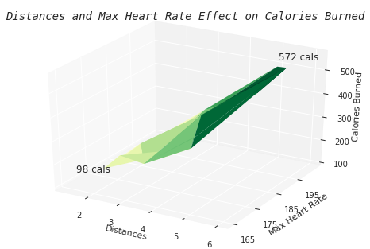
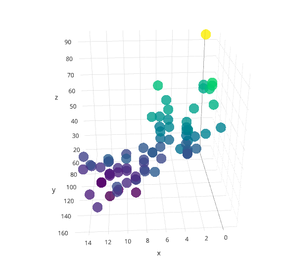
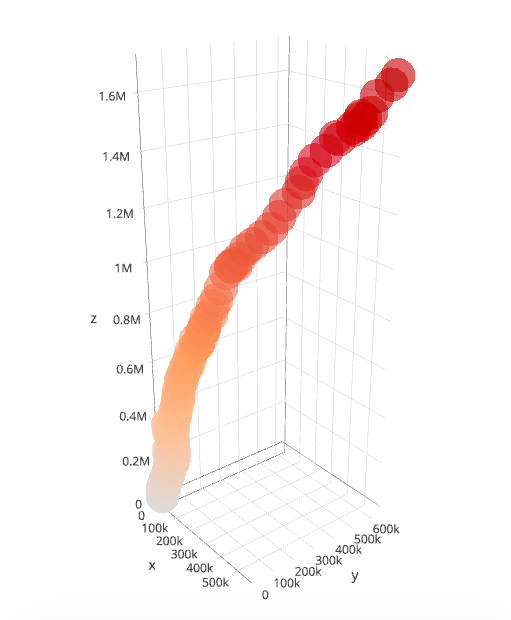

# Node
## running_data_projection.py
  Collecting data on my max heart rate and mileage during run to find effect on calories burned.

## bike_share.ipynb
  Looking at Bike Share Data and mapping the frequency of bike shares in locations around LA.

## cereal_data.ipynb
  Comparing sugar and calories against the total rating of 80 cereal brands

## econ_data.ipynb
  UK Import and Export Volume and the Effect on Real GDP (1086-2016)

